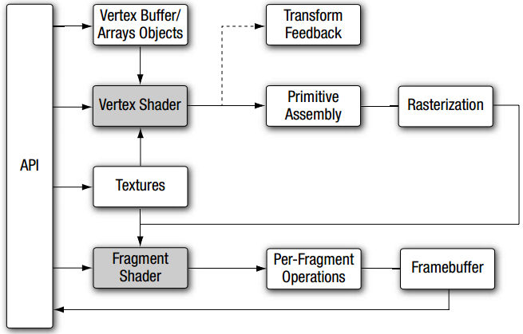

# OpenGL ES 3.0 #
如前所述，本书将介绍OpenGL ES 3.0 API。我们将详细介绍OpenGL ES 3.0规范，针对各个特性给出示例，并讨论性能优化技术。阅读本书之后，你将会对OpenGL ES 3.0 API有深入的了解，很容易的写出OpenGL ES 3.0应用，并且不用担心要阅读多个规范来理解某个特性如何工作。

OpenGL ES 3.0实现了可编程着色器的图形管线，包含两个规范：OpenGL ES 3.0 API规范以及OpenGL ES Shading Languge 3.0规范（OpenGL ES SL）。图1-1展示了OpenGL ES 3.0图形管线。阴影部分表示可编程的阶段。

图 1-1 OpenGL ES 3.0 图形管线

## Vertex Shader ##
本节将对顶点着色器进行概要介绍。顶点和图元（fragment）着色器将在后续章节中详细介绍。顶点着色器实现了通用的操作顶点的可编程方法。

顶点着色器的输入包括：

- 着色器程序 - 顶点着色器程序源代码或可执行文件，描述对顶点的操作。
- 顶点着色器输入（或属性） - 用顶点数组描述的每顶点数据。
- Uniforms - 顶点或（片元）着色器所使用的常量数据。
- Samplers - 特殊类型的uniforms，表示顶点着色器所使用的纹理。

顶点着色器的输出，在OpenGL ES 2.0中被称为varying variables，在3.0中重命名为顶点着色器输出变量（vertex shader output variables）。在光栅化阶段，将对每个生成的片元计算顶点着色器输出值，进而传给片元着色器作为输入。从顶点着色器输出的每个图元的顶点的值生成每个片元的值的过程叫做插值（interpolation）。另外，OpenGL ES 3.0增加了变换反馈（transform feedback）机制：可以有选择的将顶点着色器的输出写入输出缓存（output buffer）中（这个过程可以代替传值到片元着色器的过程，也可以与之同时进行）。例如，如第14章的例子，可以通过变换反馈将粒子输出到缓存对象中来通过顶点着色器实现粒子系统。顶点着色器的输入和输出如图1-2所示；

图1-2 OpenGL ES 3.0顶点着色器

顶点着色器可以用于传统的基于顶点的操作，如位置的矩阵变换，计算光照等式来生成每顶点的颜色，生成或变换纹理坐标。同时，由于顶点着色器由应用来指定，也可以用于自定义的行为，如新的变换、光照计算以及基于顶点的特效等，这些行为在传统的固定管线中是不支持的。

示例1-1是一段用OpenGL ES着色语言编写的顶点着色器。稍后我们将对顶点着色器进行详细的介绍。这里只是让你有一个大致的概念。这个示例将位置及与其关联的颜色数据作为输入属性，对位置应用4*4矩阵进行变换，病输出变换后得位置和颜色。

**Example 1-1** 顶点着色器示例

	1.  #version 300 es
	2.  uniform mat4 u_mvpMatrix; // 将a_position
	3.                            // 从模型空间变换到
	4.                            // 正规化设备空间
	5. 
	6.  // 顶点着色器的输入属性
	7.  in vec4 a_position; // 位置值
	8.  in vec4 a_color; // 输入ude顶点颜色
	9. 
	10. // 顶点着色器的输出 - 片元着色器的输入
	11. out vec4 v_color; // 输出顶点颜色
	12. void main()
	13. {
	14.   v_color = a_color;
	15.   gl_Position = u_mvpMatrix * a_position;
	16. }

	

